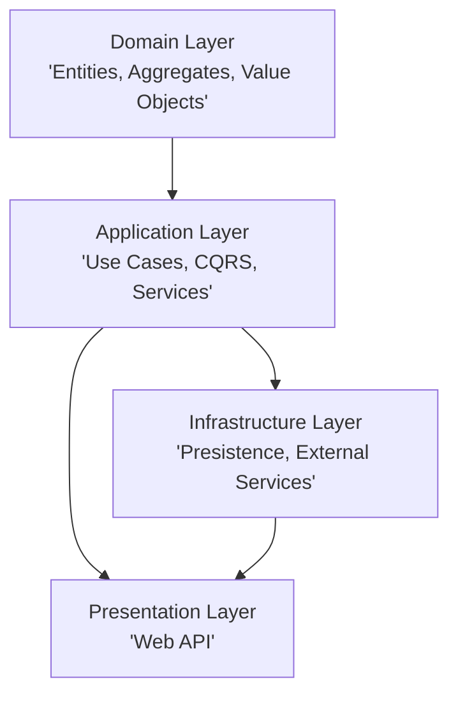

# 🛒 E-Commerce Microservices Solution (.NET)

> 🎓 This project is a hands-on implementation of concepts learned from the [.NET 8 Microservices: DDD, CQRS, Vertical/Clean Architecture](https://github.com/aspnetrun/run-aspnetcore-microservices) course.  
> 🚧 I will be actively adding new features and enhancements soon - stay tuned!

> This repository contains a complete **e-commerce platform** implemented using **.NET** and **Microservices Architecture**. Each service is independently developed, deployed, and maintained. The solution follows modern architectural patterns such as **Vertical Slicing**, **CQRS**, **Clean Architecture**, **gRPC**, and **Event-Driven Messaging** using RabbitMQ.
---

## 🧱 Architecture Overview

### ✅ Microservices Breakdown

| Service         | Responsibility                                   | Patterns Used                 | Database    | Protocol    |
|-----------------|---------------------------------------------------|-------------------------------|-------------|-------------|
| **CatalogAPI**   | Manage product information                        | Vertical Slicing, CQRS        | PostgreSQL  | REST        |
| **BasketAPI**    | Manage user shopping carts and checkout process   | Vertical Slicing, CQRS, RabbitMQ        | PostgreSQL  | REST        |
| **DiscountgRPC** | Handle discounts for products                     | Repository Pattern            | SQLite      | gRPC        |
| **OrderingAPI**  | Process orders from checked-out baskets           | Clean Architecture, RabbitMQ | PostgreSQL  | REST        |

---

## 🔧 Technologies Used

- **.NET 8** – Core framework for APIs  
- **PostgreSQL** – Primary database for most services  
- **SQLite** – Lightweight local storage for discount service  
- **gRPC** – High-performance inter-service communication  
- **RabbitMQ** – Asynchronous messaging for order processing  
- **CQRS** – Command Query Responsibility Segregation  
- **Vertical Slicing** – Feature-oriented service design  
- **Clean Architecture** – Domain-driven design separation  

---

# 📁 Clean Architecture Design
The following diagram depicts the **Clean Architecture Design** used in the Ordering microservice.

# 📌 Key Design Highlights

- ✅ Decoupled services for modularity and scalability
- 📦 gRPC for lightweight internal communication
- 📨 RabbitMQ for event-driven architecture
- 🔍 CQRS for clear separation of read/write operations
- 🧼 Clean Architecture in OrderingAPI for maintainability

# 🚀 Future Enhancements
- Add identity and authentication microservice
- Integrate distributed tracing (OpenTelemetry)
- Add payment gateway integration
- Implement product search using ElasticSearch

# Important Notes for MAC users
## EF Core Commands for VS Code and .NET CLI
Visual Studio Code and .NET CLI
  - dotnet tool install --global dotnet-ef
  - dotnet add package Microsoft.EntityFrameworkCore.Design
  - dotnet ef migrations add InitialCreate
  - dotnet ef database update

## Run EF Migration using cli
dotnet ef migrations add InitialPostgresCreate -o Data/Migrations -p Ordering.Infrastructure.csproj -s ../OrderingAPI/OrderingAPI.csproj
## Run EF Update using cli
dotnet ef database update --project Ordering.Infrastructure.csproj --startup-project ../OrderingAPI/OrderingAPI.csproj   

